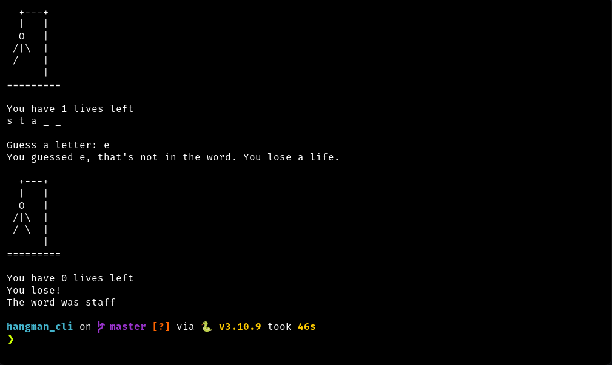

# Hangman Game

A simple implementation of the classic Hangman game in Python. Test your vocabulary and guessing skills!

## Overview

This game selects a random word, and the player has to guess it letter by letter. With each wrong guess, a part of the hangman figure is drawn. The player wins if they guess the word before the hangman is fully drawn, and loses otherwise.

## Setup and Installation

1. Clone the repository:
```bash
git clone https://github.com/j-breedlove/hangman_cli.git
cd hangman_cli
```

2. Set up a virtual environment using pipenv:
```bash
pip install pipenv
pipenv install
```

3. Activate the pipenv environment:
```bash
pipenv shell
```

## How to Play

1. Run the `hangman.py` script:
```bash
python hangman.py
```

2. The game will display the current state of the word (with underscores for unguessed letters) and the hangman figure.
3. Guess a letter by entering it.
4. Continue guessing until you either guess the word correctly or run out of lives.

## Files

- `hangman.py`: Main game script.
- `hangman_art.py`: Contains the hangman figure drawings and game logo.
- `hangman_words.py`: Contains a list of words from which the game selects a random word.

## Requirements

- Python 3
- Pipenv

Enjoy the game and have fun!
